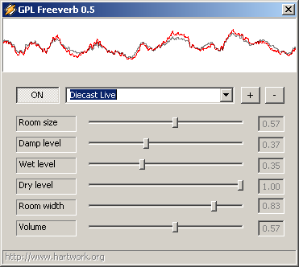
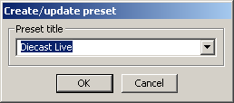

# dsp_freeverb_gpl

## About

The *GPL Freeverb Winamp Plugin* (a.k.a. **dsp_freeverb_gpl**)
was my take at bringing Jeremy Wakefield's Freeverb sound effect
implementation to Winamp in 2006.  For some types of music,
it can add live/concert-like feel.  The plug-in comes with support
for presets and a simple live visualization of the waveform
before and after processing.

## History

### 0.7.1 (2006-05-04)

- Changed: Button text now switches `ON`/`OFF`

### 0.7 (2006-05-03)

- Added: Extra dialog for adding presets
- Fixed: Bug when deleting presets
- Added: One more built-in preset

### 0.6.1 (2006-04-23)

### 0.6 (2006-04-23)

- First version [shared with the public](http://forums.winamp.com/showthread.php?threadid=244394)

### 0.5 (2006-04-23)

### 0.3.3.3 (2006-04-23)
